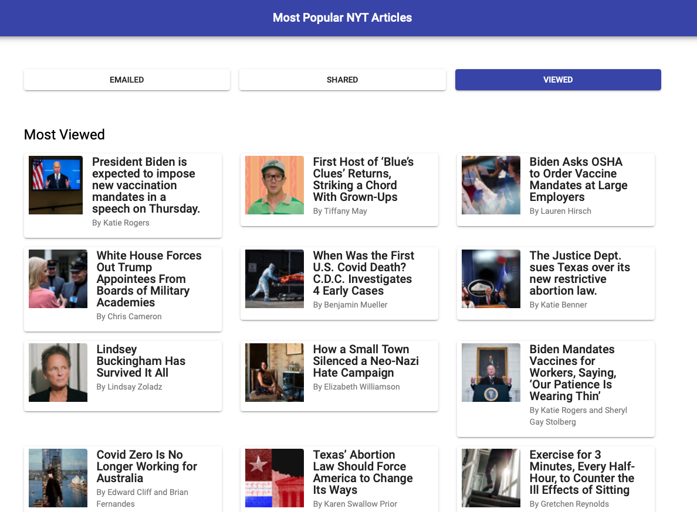

<!-- PROJECT SHIELDS -->

[![Contributors][contributors-shield]][contributors-url]
[![Forks][forks-shield]][forks-url]
[![Stargazers][stars-shield]][stars-url]
[![Issues][issues-shield]][issues-url]
[![MIT License][license-shield]][license-url]
[![LinkedIn][linkedin-shield]][linkedin-url]

<!-- PROJECT LOGO -->
<br />
<p align="center">
  <a href="https://github.com/SciFiTy10/MostPopularNYTArticles">
    
  </a>

  <h3 align="center">Most Popular NYT Articles</h3>

  <p align="center">
    The most emailed, shared to Facebook, and most viewed articles from the New York Times.
    <br />
    <a href="https://github.com/SciFiTy10/MostPopularNYTArticles"><strong>Explore the docs »</strong></a>
    <br />
    <br />
    <a href="https://github.com/SciFiTy10/MostPopularNYTArticles/issues">Report Bug</a>
    ·
    <a href="https://github.com/SciFiTy10/MostPopularNYTArticles/issues">Request Feature</a>
  </p>
</p>

<!-- TABLE OF CONTENTS -->
<details open="open">
  <summary>Table of Contents</summary>
  <ol>
    <li>
      <a href="#about-the-project">About The Project</a>
      <ul>
        <li><a href="#built-with">Built With</a></li>
        <li><a href="#state-management">State Management</a></li>
        <li><a href="#project-folder-structure">Project Folder Structure</a></li>
        <li><a href="#things-i-learned-and-things-i-wouldve-done-differently">Things I Learned and Things I Would've Done Differently</a></li>
      </ul>
    </li>
    <li>
      <a href="#getting-started">Getting Started</a>
      <ul>
        <li><a href="#prerequisites">Prerequisites</a></li>
        <li><a href="#installation">Installation</a></li>
        <li><a href="#running-project">Running Project</a></li>
        <li><a href="#running-tests">Running Tests</a></li>
      </ul>
    </li>
    <li><a href="#usage">Usage</a></li>
    <li><a href="#roadmap">Roadmap</a></li>
    <li><a href="#contributing">Contributing</a></li>
    <li><a href="#license">License</a></li>
    <li><a href="#contact">Contact</a></li>
    <li><a href="#acknowledgements">Acknowledgements</a></li>
  </ol>
</details>

<!-- ABOUT THE PROJECT -->

## About The Project

<!--add link to main page -->


Welcome to the Most Popular NYT Articles App!

This application calls the NYT Most Popular Articles API in each of its 3 versions:

1. The most emailed articles
2. The most shared to Facebook articles
3. The most viewed articles

The user is able to navigate to each of these options by clickig a navigation button which leverages [Angular Routing](https://angular.io/guide/routing-overview).

This was an app I built to challenge myself to learn how effective I could be at picking up a new framework I didn't have experience in.

I had plenty of experience professionally with Vue and personal project experience with React at the time of building this, and I wanted to see how that experience translated to Angular.

Since this was a personal test I gave myself, I wanted to see this through feature completion. Had this have been a long term, or professional project, I wouldn't have hard set the API key. I would've introduced authentication, and then had the token returned give access to call an endpoint which securely held the API key.

---

### Built With

- [Angular](https://angular.io)
- [Typescript](https://www.typescriptlang.org)
- [Angular Material](https://material.angular.io)
- [Angular Flex Layout](https://github.com/angular/flex-layout)

---

### State Management

This application does not persist application state. Each load of the page is a new call to the emailed endpoint. No user actions are recorded.

---

### Project Folder Structure

Within the app folder, there is a pretty straightforward organization of the project's subfolders.

- Each component is given its own folder.
  - inside those folders follows a pattern:
    - a CSS stylesheet
    - an HTML file
    - a Typescript file
    - a spec file for testing
- There are sibling files within the app folder which hold:
  - routing information
  - app level information
  - services which are injected into specific components
- There is an interfaces folder which holds Typescript definitions for different objects.
  - Ex: an Article, an Emailed Article, etc.

---

### Things I Learned and Things I Would've Done Differently

- Thanks to my background in Vue, a lot of directives Angular uses were easy to pick up

Working with ng-for and ng-if was a breeze since I already knew how that functioned

- I needed to study up more on Observables

This was something new for me at the time. I had been used to working with client libraries like Axios, so being nudged into a new method of making http requests in this fashion took some tinkering.

- For a front end framework that was created by the same company that created Material Design, I was shocked at how Angular Material's documentation wasn't on par with either Vuetify or Material UI

The [documentation](https://material.angular.io/components/button/examples) didn't feel complete in the same regard that Material UI or Vuetify's documentation does. There are times when you'll have to do follow up searches to understand something, but I felt like I did much more of that with Angular Material compared to the other 2.

Angular absolutely made me a believer in Typescript and I look forward to implementing that in my projects going forward.

<!-- GETTING STARTED -->

## Getting Started

To get a local copy up and running follow these simple steps.

### Prerequisites

Make sure you have the latest version of npm installed

- npm
  ```sh
  npm install npm@latest -g
  ```

---

### Installation

1. Clone the repo
   ```sh
   git clone https://github.com/SciFiTy10/MostPopularNYTArticles.git
   ```
2. Install NPM packages
   ```sh
   npm install
   ```

---

### Running Project

1. Running the project in development mode

   ```sh
   ng serve
   ```

   Then open https://localhost:4200 in your browser.

   Alternatively, to open in your default browser you can do

   ```sh
   ng serve --open
   ```

<!-- USAGE EXAMPLES -->

## Usage

<!--emailed -->

View the most emailed NYT Articles.


<!--shared -->

View the most shared NYT Articles.


<!--viewed -->

View the most viewed NYT Articles.


<!-- ROADMAP -->

## Roadmap

See the [open issues](https://github.com/SciFiTy10/burger-restaurant/issues) for a list of proposed features (and known issues).

<!-- CONTRIBUTING -->

## Contributing

Contributions are what make the open source community such an amazing place to learn, inspire, and create. Any contributions you make are **greatly appreciated**.

1. Fork the Project
2. Create your Feature Branch (`git checkout -b feature/AmazingFeature`)
3. Commit your Changes (`git commit -m 'Add some AmazingFeature'`)
4. Push to the Branch (`git push origin feature/AmazingFeature`)
5. Open a Pull Request

<!-- LICENSE -->

## License

Distributed under the MIT License. See `LICENSE` for more information.

<!-- CONTACT -->

## Contact

Tyler Ridings - [LinkedIn](https://www.linkedin.com/in/tyler-ridings-24804585/)

Personal Portfolio - [https://www.tylerridings.dev](https://www.tylerridings.dev)

<!-- ACKNOWLEDGEMENTS -->

## Acknowledgements

- [The New York Times](https://www.nytimes.com)

<!-- MARKDOWN LINKS & IMAGES -->

[contributors-shield]: https://img.shields.io/github/contributors/SciFiTy10/MostPopularNYTArticles.svg?style=for-the-badge
[contributors-url]: https://github.com/SciFiTy10/MostPopularNYTArticles/graphs/contributors
[forks-shield]: https://img.shields.io/github/forks/SciFiTy10/MostPopularNYTArticles.svg?style=for-the-badge
[forks-url]: https://github.com/SciFiTy10/MostPopularNYTArticles/network/members
[stars-shield]: https://img.shields.io/github/stars/SciFiTy10/MostPopularNYTArticles.svg?style=for-the-badge
[stars-url]: https://github.com/SciFiTy10/MostPopularNYTArticles/stargazers
[issues-shield]: https://img.shields.io/github/issues/SciFiTy10/MostPopularNYTArticles.svg?style=for-the-badge
[issues-url]: https://github.com/SciFiTy10/MostPopularNYTArticles/issues
[license-shield]: https://img.shields.io/github/license/SciFiTy10/MostPopularNYTArticles.svg?style=for-the-badge
[license-url]: https://github.com/SciFiTy10/MostPopularNYTArticles/LICENSE.txt
[linkedin-shield]: https://img.shields.io/badge/-LinkedIn-black.svg?style=for-the-badge&logo=linkedin&colorB=555
[linkedin-url]: https://www.linkedin.com/in/tyler-ridings-24804585/
